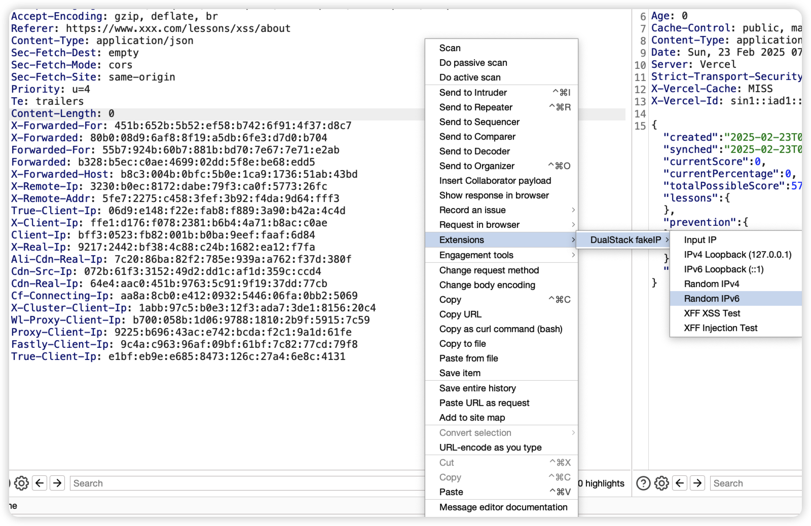
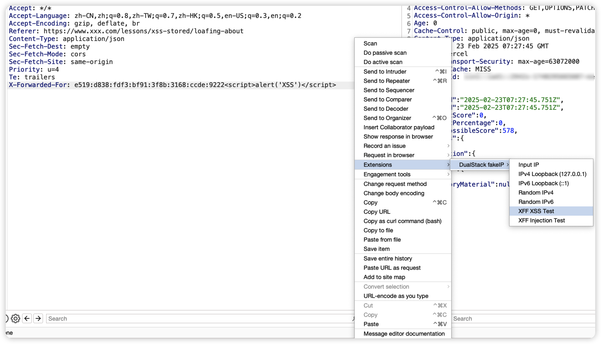
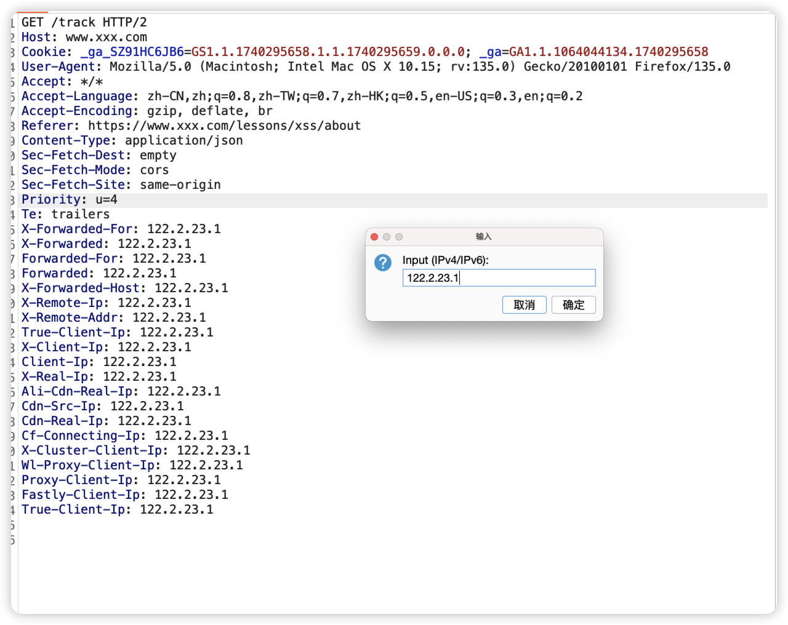

```
# DualStack fakeIP Burp Extension


支持双栈（IPv4/IPv6）的伪造IP Burp插件，可用于测试服务器端IP验证逻辑，支持Intruder模块爆破。

## 主要功能

- 支持20+种常见IP头伪造

- 双栈IP支持：
  - IPv4本地环回（127.0.0.1）
  - IPv6本地环回（::1）
  - 随机IPv4地址生成
  - 随机IPv6地址生成
  
  
- 渗透测试辅助功能：
  - X-Forwarded-For头XSS测试Payload一键生成
  - X-Forwarded-For头SQL注入测试Payload一键生成
  - Payload为固定Payload，如有高级需求请自行修改代码
 
  
- Intruder爆破支持：
  - IPv4专用模式
  - IPv6专用模式
  - 双栈混合模式
  - 默认生成100个，如有需求请自行修改数量

## 安装使用

1. 下载扩展文件：`DualStack_fakeIP.py`
2. 在Burp Suite中加载扩展：
   - Extender -> Extensions -> Add
   - 选择Python环境
   - 选择下载的.py文件
3. 在HTTP请求上右键使用：
   - 选择"DualStack fakeIP"菜单
   - 根据需求选择IP类型
 

## 功能说明

### 基础功能
| 菜单项                  | 说明                          |
|------------------------|-----------------------------|
| Input IP             | 自定义输入任意IP地址             |
| IPv4 Loopback        | 设置所有IP头为127.0.0.1         |
| IPv6 Loopback        | 设置所有IP头为::1               |
| Random IPv4          | 生成随机IPv4地址               |
| Random IPv6          | 生成随机IPv6地址               |

### 安全测试
| 菜单项                  | 生成Payload示例                |
|------------------------|------------------------------|
| XFF XSS Test         | 127.0.0.1<script>alert(1)</script> |
| XFF Injection Test   | 2001:db8::1' OR 1=1-- -         |

### Intruder爆破
1. 在Intruder模块选择Payload类型
2. 选择"fakeIpPayloads"生成器
3. 点击start attack之后选择生成模式：
   - IPv4 Only：纯IPv4地址
   - IPv6 Only：纯IPv6地址
   - Both：混合生成双栈地址


## 支持头列表
X-Forwarded-For, X-Forwarded, Forwarded-For, Forwarded,

X-Forwarded-Host, X-remote-IP, X-remote-addr, True-Client-IP,

X-Client-IP, Client-IP, X-Real-IP, Ali-CDN-Real-IP, Cdn-Src-Ip,

Cdn-Real-Ip, CF-Connecting-IP, X-Cluster-Client-IP,

WL-Proxy-Client-IP, Proxy-Client-IP, Fastly-Client-Ip, True-Client-Ip

 
## 注意事项

1. 随机IPv6地址生成符合RFC 4291规范
2. 修改多个头时注意服务器解析顺序

## 许可证

MIT License


## 插件开发借鉴

https://github.com/TheKingOfDuck/BurpFakeIP
```